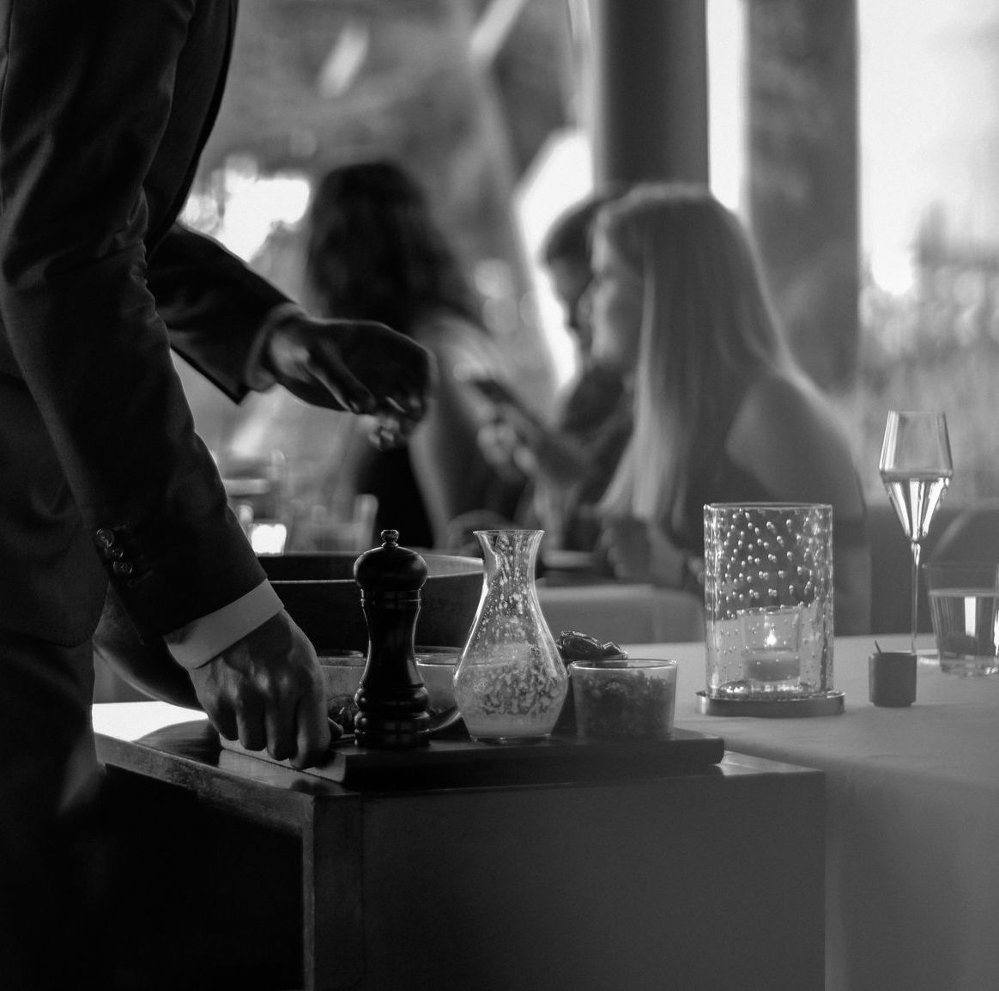

# Canlis - Restaurant Website

This project is a fully responsive and interactive website designed for **Canlis**, a fine dining restaurant. The website features a hero section, reservation form, detailed information about the space, the executive chef, and a visually rich menu layout.

## Features

- **Hero Section**: Includes a background video, hero image, and navigation menu.
- **Invitation Section**: A personal invitation for guests to experience dining at Canlis.
- **The Space**: Information about the restaurant’s design and its views of Seattle.
- **In the Press**: A section showcasing the executive chef and some press highlights.
- **Menu**: Two images representing the restaurant’s dishes and offerings.
- **Reservation**: Call-to-action for users to make a reservation.
- **Footer**: Includes information about the restaurant's policies, newsletter, and contact details.

## Files and Structure

### `index.html`
The main HTML file that contains the structure of the website.

### CSS Files
- `style.css`: The primary stylesheet for styling the website.
- `styles-below-hero.css`: Additional styles specifically for the content below the hero section.
- `footer.css`: Styles related to the footer section.
- `style1.css`: Supplemental styles (likely for responsive elements).

### JavaScript
- `script.js`: JavaScript file that controls the functionality, such as the menu toggle.

### Assets
The project uses assets stored in the `Assets` directory, including:
- **Images**: Various images used for the hero section, invitation, space, chef, and menu.
- **Videos**: Background video for the hero section.
- **Favicon**: Favicons for different devices.

## Installation

1. **Clone the repository** to your local machine using the following command:

    ```bash
    git clone https://github.com/Vikas2604/canlis-restaurant-website.git
    ```

2. **Navigate to the project directory**:

    ```bash
    cd canlis-restaurant-website
    ```

3. **Open `index.html`** in your web browser to view the website:

    - You can open it directly using a browser or use a local server if needed.

    ```bash
    open index.html
    ```

## Screenshots


*Screenshot of the Hero section with background video.*


*Screenshot of the Invitation section.*

## Usage

- **Responsive Design**: The website is designed to be fully responsive. You can test the responsiveness by resizing the browser or testing on different devices (desktop, tablet, mobile).
- **Menu Toggle**: The menu navigation is hidden for mobile users and can be toggled using a "Menu" button.
- **Interactive Elements**: Click on the links for reservations, menu items, and other details.

## Contributing

Contributions are welcome! To contribute:

1. Fork the repository.
2. Create a new branch (`git checkout -b feature-branch`).
3. Make your changes.
4. Commit your changes (`git commit -am 'Add new feature'`).
5. Push to the branch (`git push origin feature-branch`).
6. Create a pull request.

## Credits

- **Canlis Restaurant**: This website is a fictional representation inspired by a high-end dining restaurant.
- **Design**: Inspired by modern restaurant websites with responsive navigation and interactive sections.

---

**Contact Information**:  
Call: (206) 283-3323  
Email: [reservation@canlis.com](mailto:reservation@canlis.com)  

© 1950 - 2024 Canlis-Clone
